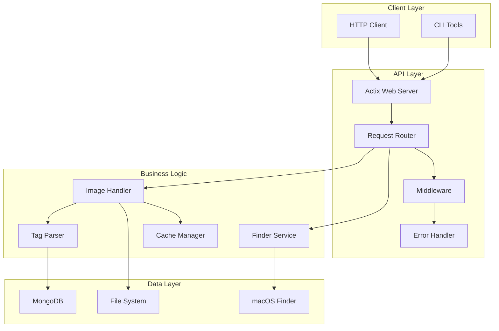
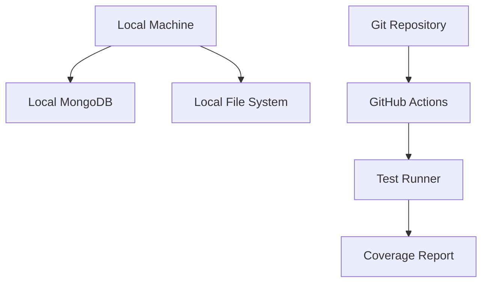
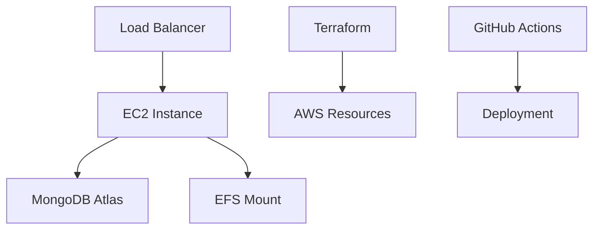

# Images API - Technical Architecture

This document provides a detailed technical overview of the Images API architecture, including data flows, component interactions, and implementation details.

## System Architecture

### Component Diagram



## Component Details

### 1. API Layer

#### Actix Web Server
- **Implementation**: `main.rs`
- **Configuration**:
  - Bind address: 192.168.86.242:8081
  - Workers: Number of CPU cores
  - Keep-alive: 75 seconds
- **Middleware**:
  - Logger
  - Compression
  - CORS
  - Error handling

#### Request Router
- **Implementation**: `main.rs`, `handlers.rs`
- **Key Routes**:
  ```rust
  /health
  /gallery/images
  /gallery/proxy-image/{filename}
  /gallery/images/{filename}/info
  /gallery/content
  ```

### 2. Business Logic

#### Image Handler (`handlers.rs`)
- Manages image retrieval and metadata operations
- Implements async/await for non-blocking I/O
- Uses tokio runtime for async operations
- Handles image format detection and validation

#### Finder Service (`finder.rs`)
- Integrates with macOS Finder API
- Provides content search functionality
- Implements metadata extraction
- Handles file system traversal

#### Tag Parser
- Parses macOS Finder tags from xattr data
- Supports standard macOS colors:
  - Red
  - Orange
  - Yellow
  - Green
  - Blue
  - Purple
  - Gray

### 3. Data Layer

#### MongoDB Integration
- **Collection Structure**:
  ```json
  {
    "_id": ObjectId,
    "filename": String,
    "path": String,
    "size": Number,
    "date": Date,
    "macos_attributes": {
      "xattr": String,
      "tags": [String]
    }
  }
  ```
- Uses MongoDB Atlas for hosting
- Implements connection pooling
- Handles automatic reconnection

#### File System Integration
- Uses async file I/O with tokio
- Implements efficient file streaming
- Handles large file transfers

## Infrastructure Architecture

### Development Environment



### Production Environment



## Deployment Architecture

### Terraform Resources

```hcl
# Key Resource Types
- aws_instance
- aws_security_group
- aws_efs_file_system
- aws_efs_mount_target
- mongodbatlas_cluster
```

### CI/CD Pipeline

1. **Build Stage**
   - Rust compilation
   - Unit tests
   - Integration tests
   - Docker image build

2. **Test Stage**
   - Security scanning
   - Performance testing
   - API testing

3. **Deploy Stage**
   - Terraform apply
   - Application deployment
   - Health check verification

## Performance Considerations

### Caching Strategy
- In-memory caching for frequently accessed metadata
- File system cache for image data
- MongoDB query optimization

### Concurrency
- Async I/O throughout
- Connection pooling
- Worker thread pool

### Monitoring
- Health endpoint metrics
- MongoDB performance metrics
- System resource utilization

## Security

### Authentication
- API key validation
- JWT token support (planned)

### Authorization
- Role-based access control (planned)
- File system permissions

### Data Protection
- TLS encryption
- Secure MongoDB connection
- Sanitized file paths

## Testing Strategy

### Unit Tests
- Handler logic
- Tag parsing
- File operations

### Integration Tests
- API endpoints
- MongoDB operations
- File system operations

### Performance Tests
- Load testing with hey
- Concurrent request handling
- Resource utilization

## Future Enhancements

1. **Planned Features**
   - Image processing capabilities
   - WebSocket notifications
   - Enhanced search functionality

2. **Technical Improvements**
   - GraphQL API
   - Redis caching
   - Kubernetes deployment

3. **Monitoring Enhancements**
   - Prometheus metrics
   - Grafana dashboards
   - ELK stack integration
