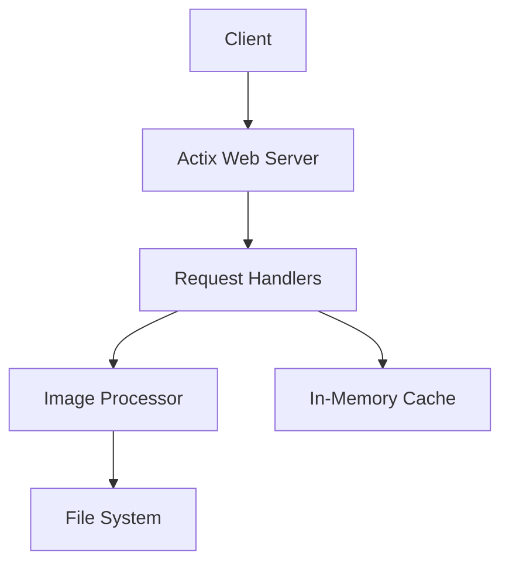

# Images API

A high-performance image serving and processing API built with Rust and Actix Web.

## Features

- Fast image serving with async I/O
- Image metadata extraction
- Health check endpoint
- Comprehensive test suite including:
  - Unit tests
  - Integration tests
  - Performance benchmarks

## Architecture

### Overview
The Images API is built using a modular architecture with the following key components:



### Components

1. **Web Server (Actix Web)**
   - Handles HTTP requests
   - Manages concurrent connections
   - Provides routing and middleware support

2. **Request Handlers (`handlers.rs`)**
   - `/health` - Service health check
   - `/images` - List available images
   - `/images/{filename}` - Serve specific image
   - `/images/{filename}/info` - Get image metadata

3. **Image Processor (`image_processor.rs`)**
   - Image loading and validation
   - Format conversion
   - Resizing and rotation
   - Metadata extraction

4. **Caching Layer**
   - In-memory cache using `HashMap`
   - Thread-safe with `Arc<RwLock<>>`
   - Improves response times for frequently accessed images

### Data Flow

1. Client makes HTTP request
2. Actix Web routes request to appropriate handler
3. Handler checks cache for requested resource
4. If not in cache:
   - Image Processor loads from filesystem
   - Processes image if needed (resize/rotate)
   - Caches result for future requests
5. Response sent to client

## Prerequisites

- Rust (latest stable version)
- Cargo
- Terraform (for local development)

## Getting Started

1. Clone the repository:
```bash
git clone https://github.com/YOUR_USERNAME/images-api.git
cd images-api
```

2. Build the project:
```bash
cargo build
```

3. Run the tests:
```bash
./scripts/test.sh
```

4. Start the server:
```bash
cargo run
```

The server will start on `http://localhost:8081`

## Setup and Configuration

### Prerequisites
- Rust 1.70 or higher
- Cargo package manager
- Image processing libraries (automatically installed via Cargo)

### Environment Variables
- `IMAGES_DIR`: Directory containing images (default: "./images")
- `PORT`: Server port (default: 8081)

### Installation
```bash
# Clone the repository
git clone https://github.com/yourusername/images-api.git
cd images-api

# Build the project
cargo build --release

# Run tests
cargo test

# Start the server
cargo run --release
```

## API Endpoints

### Health Check
```http
GET /health
```
Returns service health status
```json
{
    "status": "healthy",
    "timestamp": "2024-12-06T23:12:54Z"
}
```

### List Images
```http
GET /images?page=1&per_page=10
```
Returns paginated list of available images
```json
{
    "images": [
        {
            "filename": "example.jpg",
            "size_bytes": 1024,
            "dimensions": [800, 600],
            "last_modified": "2024-12-06T23:12:54Z"
        }
    ],
    "total": 100,
    "page": 1,
    "per_page": 10
}
```

### Serve Image
```http
GET /images/{filename}
```
Serves the requested image file
- Supports JPEG, PNG, GIF formats
- Optional resize parameters: ?width=800&height=600
- Optional rotation: ?rotate=90

### Image Info
```http
GET /images/{filename}/info
```
Returns metadata about the specified image
```json
{
    "filename": "example.jpg",
    "dimensions": [800, 600],
    "size_bytes": 1024,
    "last_modified": "2024-12-06T23:12:54Z",
    "format": "jpeg"
}
```

## API Documentation

The API is documented using OpenAPI 3.0 (Swagger) specification. The full API documentation can be found in `openapi.yaml` in the root directory.

### Viewing the Documentation

1. **Online Swagger Editor**:
   - Visit [Swagger Editor](https://editor.swagger.io/)
   - Copy the contents of `openapi.yaml` into the editor

2. **Local Swagger UI**:
   ```bash
   # Using Docker
   docker run -p 80:8080 -e SWAGGER_JSON=/openapi.yaml -v $(pwd)/openapi.yaml:/openapi.yaml swaggerapi/swagger-ui
   ```
   Then visit `http://localhost:80`

3. **VS Code Extension**:
   - Install "OpenAPI (Swagger) Editor" extension
   - Open `openapi.yaml` and use the preview feature

### API Endpoints Summary

All endpoints are documented in detail in the OpenAPI specification. Here's a quick overview:

| Endpoint | Method | Description |
|----------|--------|-------------|
| `/health` | GET | Health check endpoint |
| `/images` | GET | List available images (paginated) |
| `/images/{filename}` | GET | Serve image file |
| `/images/{filename}/info` | GET | Get image metadata |

For detailed request/response schemas, parameters, and examples, please refer to the OpenAPI documentation.

## Infrastructure (Terraform)

### Directory Structure
```
terraform/
└── environments/
    └── local/              # Local development environment
        ├── main.tf         # Main configuration
        ├── .terraform/     # Terraform plugins and modules
        └── terraform.tfstate # State file
```

### Local Development Setup

The project uses Terraform to manage the local development environment. The configuration:
1. Creates necessary directories (logs)
2. Builds the release binary
3. Runs the service as a background process
4. Manages cleanup on destruction

### Environment Variables
The local environment is configured with:
- `RUST_LOG=debug`: Detailed logging
- `IMAGES_DIR=/Volumes/VideosNew/Models`: Image source directory

### Deployment
```bash
# Navigate to local environment directory
cd terraform/environments/local

# Initialize Terraform
terraform init

# Plan changes
terraform plan

# Apply changes (starts the service)
terraform apply
```

### Destruction
```bash
# Stop the service and clean up
terraform destroy

# Verify
- Check that the process is stopped (no process ID in api.pid)
- Verify logs in ./logs directory
```

### Important Notes
1. The service runs as a background process
2. Logs are written to:
   - `logs/stdout.log`
   - `logs/stderr.log`
3. Process ID is stored in `api.pid`
4. Service runs on port 8081 by default

### Outputs
- `health_check_endpoint`: URL for health check
- `logs_location`: Directory containing service logs

## Testing

### Test Coverage
Current test coverage: 59.46% (88/148 lines)

### Running Tests
```bash
# Run all tests
cargo test

# Run specific test
cargo test test_name

# Run with coverage
cargo tarpaulin
```

## Performance

### Benchmarks
- Response time: < 100ms for cached images
- Concurrent connections: 1000+
- Memory usage: < 512MB under load

### Load Testing
```bash
# Using wrk for benchmarking
wrk -t12 -c400 -d30s http://localhost:8081/health
```

## Security Considerations

1. **Authentication**: Currently open API, consider adding:
   - API key validation
   - JWT authentication
   - Rate limiting

2. **File Access**
   - Restricted to configured directory
   - File type validation
   - Size limits

3. **Error Handling**
   - No sensitive data in errors
   - Proper logging
   - Rate limiting on failed requests

## Contributing

1. Fork the repository
2. Create feature branch
3. Make changes
4. Run tests
5. Submit pull request

## License

[MIT License](LICENSE)
