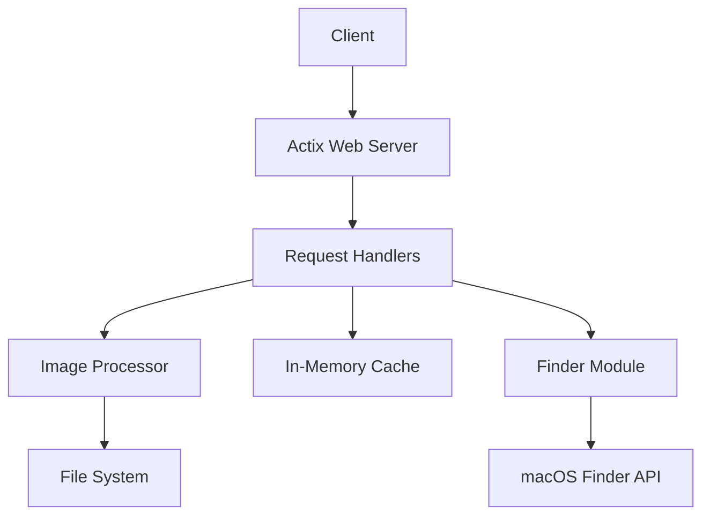

# Images API

A high-performance image serving and processing API built with Rust and Actix Web.

## Features

- Fast image serving with async I/O
- Image metadata extraction
- Content search using macOS Finder API
- Image processing (resize, rotate)
- In-memory caching
- Health check endpoint
- Comprehensive test suite including:
  - Unit tests
  - Integration tests
  - Performance benchmarks

## Architecture

### Overview
The Images API is built using a modular architecture with the following key components:



### Components

1. **Web Server (Actix Web)**
   - Handles HTTP requests
   - Manages concurrent connections
   - Provides routing and middleware support

2. **Request Handlers (`handlers.rs`)**
   - `/health` - Service health check
   - `/images` - List available images
   - `/images/{filename}` - Serve specific image
   - `/images/{filename}/info` - Get image metadata
   - `/image-content` - Search related content

3. **Image Processor (`image_processor.rs`)**
   - Image loading and validation
   - Format conversion
   - Resizing and rotation
   - Metadata extraction

4. **Finder Module (`finder.rs`)**
   - Integration with macOS Finder API
   - Content search functionality
   - Metadata retrieval
   - Tag and keyword processing

5. **Caching Layer**
   - In-memory cache using `HashMap`
   - Thread-safe with `Arc<RwLock<>>`
   - Improves response times for frequently accessed images

### Data Flow

1. Client makes HTTP request
2. Actix Web routes request to appropriate handler
3. For image requests:
   - Handler checks cache for requested resource
   - If not in cache:
     - Image Processor loads from filesystem
     - Processes image if needed (resize/rotate)
     - Caches result for future requests
4. For content search:
   - Handler calls Finder module
   - Finder queries macOS Finder API
   - Results are processed and returned
5. Response sent to client

## Prerequisites

- Rust (latest stable version)
- Cargo
- macOS (for content search functionality)

## Getting Started

1. Clone the repository:
```bash
git clone https://github.com/YOUR_USERNAME/images-api.git
cd images-api
```

2. Build the project:
```bash
cargo build
```

3. Run the tests:
```bash
cargo test
```

4. Start the server:
```bash
cargo run
```

The server will start on `http://localhost:8081`

## API Documentation

The API is documented using OpenAPI 3.0 specification. View the full documentation at:
- Local: http://localhost:8081/docs
- Swagger UI: http://localhost:8081/swagger-ui

Key endpoints:
- `GET /health` - Health check
- `GET /images` - List images
- `GET /images/{filename}` - Get image
- `GET /images/{filename}/info` - Get image metadata
- `GET /image-content` - Search related content

## Development

### Running Tests

Run all tests:
```bash
cargo test
```

Run specific test suite:
```bash
cargo test [test_name]
```

Run performance tests:
```bash
cargo test --test performance_tests
```

### Code Organization

```
.
├── src/
│   ├── main.rs           # Application entry point
│   ├── lib.rs           # Library exports
│   ├── handlers.rs      # HTTP request handlers
│   ├── image_processor.rs # Image processing logic
│   ├── finder.rs        # Content search functionality
│   └── tests/           # Test modules
├── tests/
│   └── performance_tests.rs # Performance test suite
├── openapi.yaml         # API documentation
└── README.md           # This file
```

## Contributing

1. Fork the repository
2. Create your feature branch (`git checkout -b feature/amazing-feature`)
3. Commit your changes (`git commit -m 'Add some amazing feature'`)
4. Push to the branch (`git push origin feature/amazing-feature`)
5. Open a Pull Request

## License

This project is licensed under the MIT License - see the LICENSE file for details.
