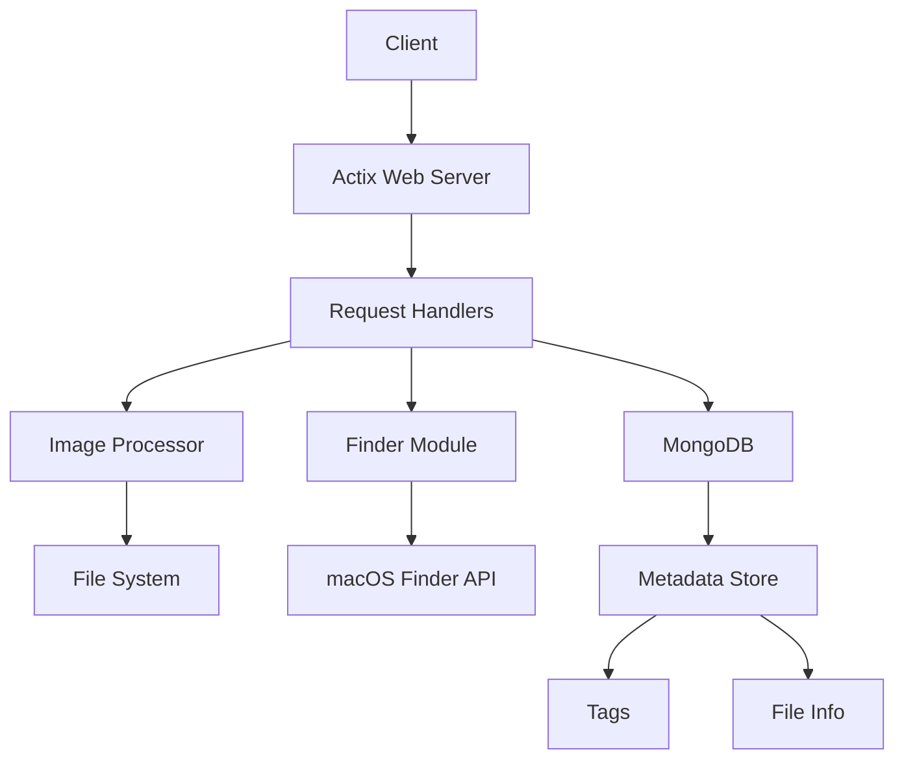

# Images API

A high-performance image serving and processing API built with Rust and Actix Web, designed to work with macOS Finder tags and metadata.

## Features

- Fast image serving with async I/O
- Image metadata extraction including macOS Finder tags
- Content search using macOS Finder API
- MongoDB integration for metadata storage
- In-memory caching
- Health check endpoint
- Terraform-managed infrastructure
- Comprehensive test suite

## Architecture

### Overview
The Images API is built using a modular architecture with the following key components:



### Components

1. **Web Server (Actix Web)**
   - Handles HTTP requests
   - Manages concurrent connections
   - Provides routing and middleware support

2. **Request Handlers (`handlers.rs`)**
   - `/health` - Service health check
   - `/gallery/images` - List available images with metadata
   - `/gallery/proxy-image/{filename}` - Serve specific image
   - `/gallery/images/{filename}/info` - Get image metadata
   - `/gallery/content` - Search related content

3. **Image Processor**
   - Image loading and validation
   - Format conversion
   - Metadata extraction
   - Tag parsing from macOS attributes

4. **Finder Module (`finder.rs`)**
   - Integration with macOS Finder API
   - Content search functionality
   - Metadata retrieval
   - Tag and keyword processing

5. **MongoDB Integration**
   - Stores image metadata and tags
   - Supports efficient querying
   - Maintains file information
   - Preserves macOS Finder tags

### Data Flow

1. Client makes HTTP request
2. Actix Web routes request to appropriate handler
3. For image requests:
   - Handler checks MongoDB for metadata
   - Loads image from filesystem
   - Returns image with cached metadata
4. For content search:
   - Handler queries MongoDB
   - Finder supplements with live filesystem data
   - Results are processed and returned
5. Response sent to client

## Prerequisites

- Rust (latest stable version)
- Cargo
- MongoDB
- macOS (for Finder API integration)
- Terraform (for infrastructure management)

## Infrastructure

The application infrastructure is managed using Terraform:

```hcl
# Key Infrastructure Components
- EC2 instance for API server
- MongoDB Atlas cluster
- Security groups and networking
- S3 bucket for image storage (optional)
```

### Terraform Setup

1. Initialize Terraform:
```bash
cd terraform
terraform init
```

2. Review the plan:
```bash
terraform plan
```

3. Apply changes:
```bash
terraform apply
```

## Development Setup

1. Clone the repository:
```bash
git clone https://github.com/WJeffBridwell/images-api.git
cd images-api
```

2. Set up environment variables:
```bash
export MONGODB_URI="your_mongodb_connection_string"
export RUST_LOG=debug
```

3. Build the project:
```bash
cargo build
```

4. Run tests:
```bash
# Unit tests
cargo test

# Integration tests
cargo test --test '*'

# With logging
RUST_LOG=debug cargo test
```

## Deployment

### Development Environment

1. Deploy infrastructure:
```bash
cd terraform
terraform workspace select dev
terraform apply
```

2. Deploy application:
```bash
./scripts/deploy.sh dev
```

### Production Environment

1. Deploy infrastructure:
```bash
cd terraform
terraform workspace select prod
terraform apply
```

2. Deploy application:
```bash
./scripts/deploy.sh prod
```

### Monitoring

- Health endpoint: `GET /health`
- Application logs: Set `RUST_LOG=debug`
- MongoDB metrics via Atlas dashboard

## Testing

### Unit Tests
```bash
cargo test
```

### Integration Tests
```bash
cargo test --test '*'
```

### Load Testing
```bash
# Using hey for HTTP load testing
hey -n 1000 -c 50 http://localhost:8081/gallery/images
```

### Manual Testing
1. Start the server:
```bash
RUST_LOG=debug cargo run
```

2. Test endpoints:
```bash
# List images
curl http://localhost:8081/gallery/images

# Get specific image
curl http://localhost:8081/gallery/proxy-image/example.jpg

# Check health
curl http://localhost:8081/health
```

## Contributing

1. Create a feature branch from `develop`
2. Make changes and add tests
3. Run full test suite
4. Create pull request to `develop`

## License

This project is proprietary and confidential.
